# Robotic Body and Camera movement

It was a team project done by:

[Kareem Mostafa](https://github.com/KareemYaseen), 
[Marwa Abdelaal](https://github.com/MarwaAbdelAal), 
[Nada Ezzat](https://github.com/nadaezzat-99), 
[Noura Mahmoud](https://github.com/Noura-Mahmoud), 
[Youssef Mohamed](https://github.com/Youssef-elkeheil)

***

## Steps

</br>

1. **head :** </br></br>
We used `glutWireSphere` function to create a wired sphere.</br></br>
2. **Body :** </br></br>
* All other Parts of  the body were made by `glutWireCube`.</br>
* The main difference between them is the Scale and the Rotation.</br></br>
3. **Rotaion :**</br></br>
* We used `glRotatef` for rotation.</br>
* For every part we made a variable for the angle of rotation.</br>
* Arms are connected together they rotate with the same key.</br></br>

4. **Keyboard :**</br></br>
    * Shoulders :</br></br>
    `q` and `Q` : rotate around Z axis.</br>
    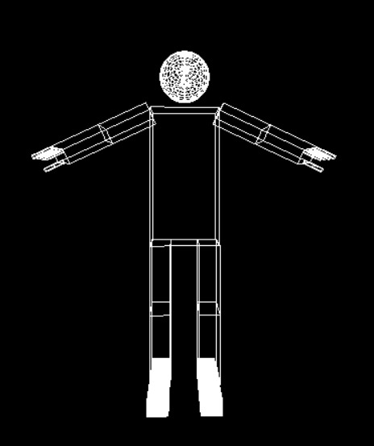</br>
    `w` and `W` : rotate around Y axis.</br></br>
    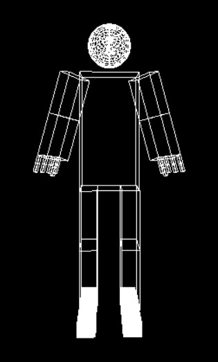</br>

    * Elbows :</br></br>
    `e` and `E` : rotate around Z axis.</br></br>
    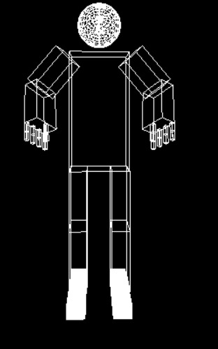</br>
    * Fingers :</br></br>
    `f` and `F` : rotate  upper fingers around Z axis.</br>
    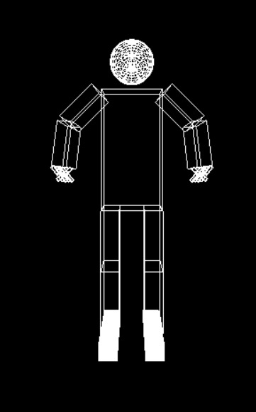</br>
    `g` and `G` : rotate  Lower fingers around Z axis.</br></br>
    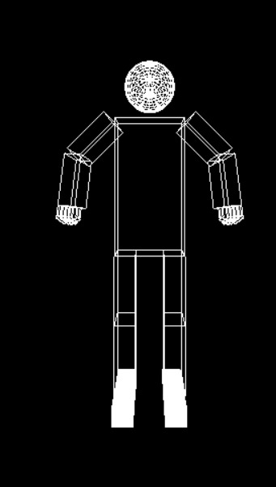</br>
    * Fumer :</br></br>
    `a` and `A` : rotate  Right Fumer around X axis.</br>
    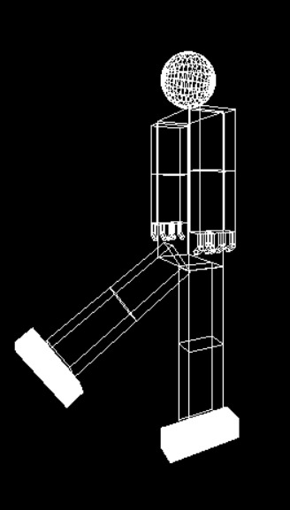</br>
    `s` and `S` : rotate  Right Fumer around Z axis.</br>
    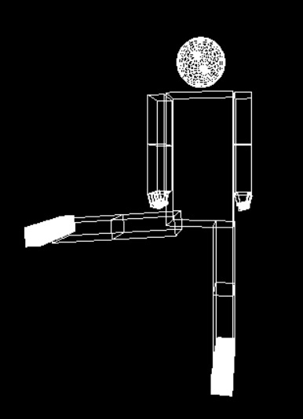</br>
    `z` and `Z` : rotate  Left Fumer around X axis.</br>
    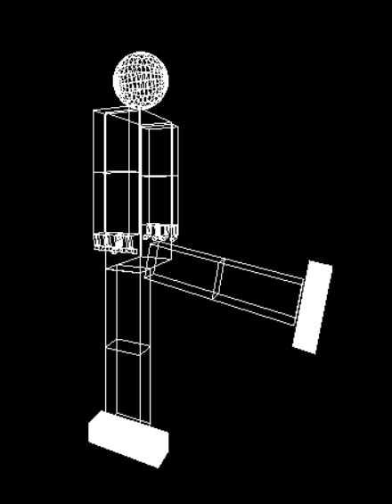</br>
    `x` and `X` : rotate  Left Fumer around Z axis.</br></br>
    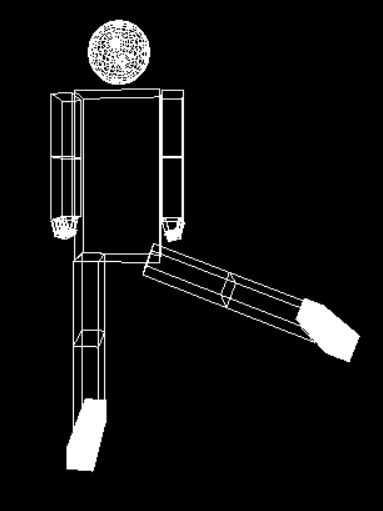</br>
    * Tibia :</br></br>
    `d` and `D` : rotate  Right Tibia around X axis.</br>
    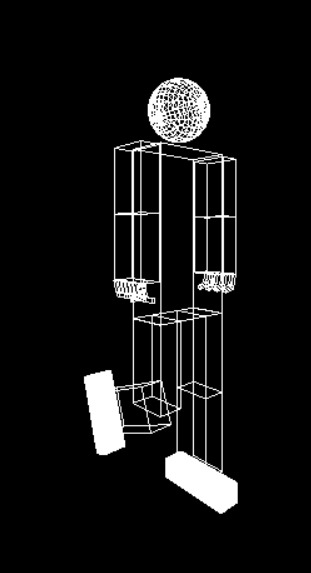</br>
    `c` and `C` : rotate  Left Tibia around X axis.</br></br>
    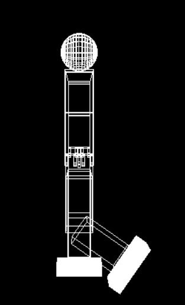</br>
    * Camera : </br></br>
    `Left Arrow` : rotate Left</br>
    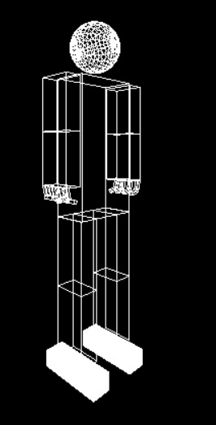</br>
    `Right Arrow` : rotate Right</br>
    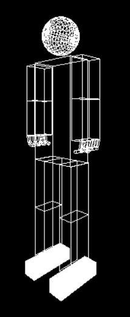</br>
    `Up Arrow` : rotate Up</br>
    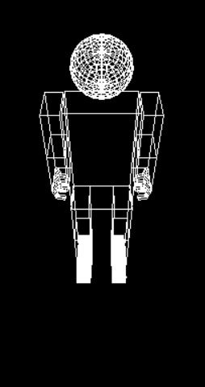</br>
    `Down Arrow` : rotate down</br>
    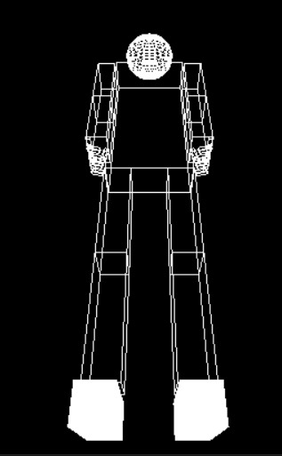</br>
    `1` : Zoom in</br>
    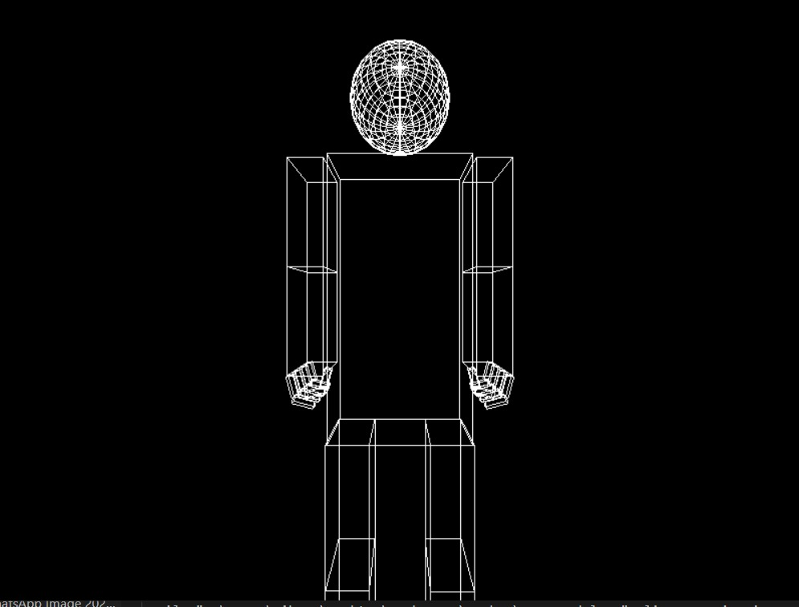</br>
    `2` : Zoom out</br>
    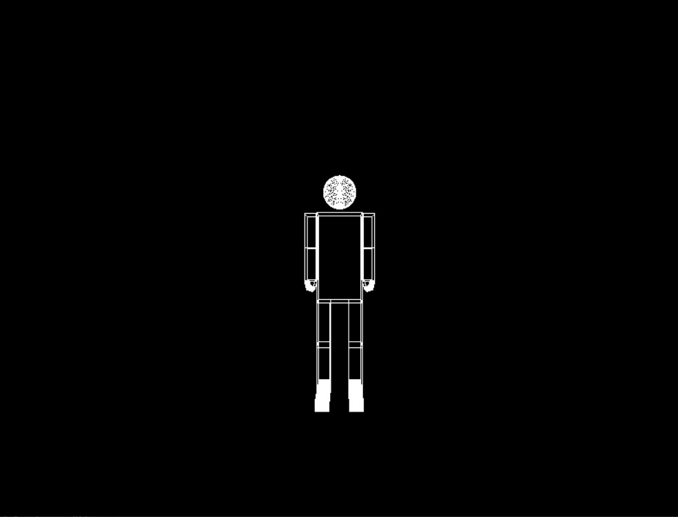</br>
    `0` : reset</br></br>
    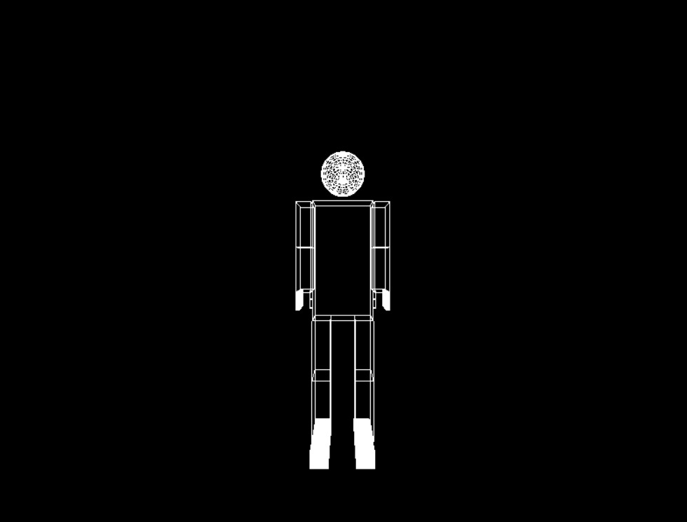</br>

## Problems

</br>

 **Linking Parts :** </br></br>
Solved by using `glPushMatrix()` and `glPopMatrix()`</br></br>

## Compile 

```bash
g++ -o main main.cpp -lGL -lglut -lGLU -lm
```

## Run 

```bash
./main
```
